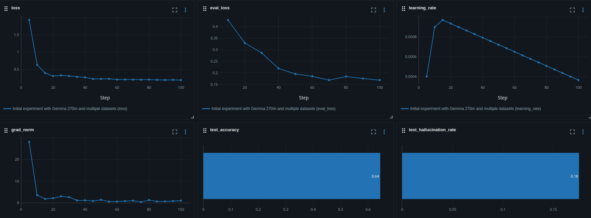

# Мини-классификатор наличия ответа на вопрос

Кузаков Дмитрий Николаевич

## Постановка задачи

Задача – понять, возможно ли обучить маленькую модель на задачу детекции наличия
ответа на вопрос в чанке текста на приличном уровне без COT. В
[статье](https://cogcomp.seas.upenn.edu/papers/SulemHaRo22.pdf) авторы обучили
BERT LARGE (340M параметров) на такую задачу на уровне чуть выше рандома.

### Формат входных и выходных данных

На вход – чанк текста и дихотомический вопрос по тексту (подразумевающий ответ
да/нет). Выход: Yes (ответ на вопрос есть в тексте и ответ “да”), No (ответ на
вопрос есть в тексте и ответ “нет”) или IDK (в тексте нет ответа на вопрос).
Например:

Context: Jane, who is a native of Los Angeles, married a lawyer from NYC.

Questions and Answers:

- Question: Did Jane marry a lawyer?
- Answer: Yes
- Question: Was Jane born in France?
- Answer: No
- Question: Did Jane marry in NYC?
- Answer: IDK

### Метрики

Хочется получить максимальное качество при минимальном количестве галлюцинаций.
То есть будем измерять hallucination rate (часть ответов Yes/No на вопросах с
правильным ответом IDK), хочется получить результат в районе 0.05. Также будем
измерять отдельно качество ответов, ответы на которые Yes или No (хочется
получить около 0.8), а также посмотрим общее accuracy для сравнения со статьёй.

### Валидация и тест

Датасеты имеют тренировочную и тестовую выборки, так что валидацию будем брать
как часть тренировочных датасетов с фиксированием сида для воспроизводимости, и
будем смотреть метрики на валидации. Тестовая выборка одного из датасетов будет
тестовой, на которой и будем смотреть итоговые метрики.

### Датасеты

Как и в статье будем брать для тренировки датасеты BoolQ_3L и c(MNLI): в конце
README репозитория ссылка на оба датасета.

- BoolQ – датасета от гугла, который состоит из 16к троек (чанк текста, вопрос,
  ответ да или нет)
- BoolQ_3L – модификация датасета, куда добавили тройки (чанк текста, вопрос,
  ответ “нет ответа”) таким образом: взяли некоторые тройки BoolQ и заменили
  чанк текста на похожий по словам, но другой чанк
- MNLI – большой датасет из 433к троек (предпосылка; гипотеза; “следование”,
  “противоречие” гипотезы из предпосылки или “не имение логической связи” между
  предпосылкой и гипотезой)
- c(MNLI) – бинаризация меток MNLI на “противоречие” и “не противоречие”.

Возможно, не получится обучить модель на всём c(MNLI), но в таком случае просто
можно взять часть датасета.

## Моделирование

### Бейзлайн

Рандомное предсказание с accuracy 0.33 или BERT LARGE из статьи, обученный на
BoolQ_3L и c(MNLI), с accuracy 0.43

### Основная модель

Будем пробовать обучать gemma3 270M c помощью LoRA с помощью фреймворка unsloth

### Внедрение

Хочется попробовать обернуть модель в сервис, а затем использовать её для поиска
релевантного чанка для ответа на вопрос (по типу RAG, только более
требовательного и, вероятно, более точного). Для начала нужно будет
конвертировать модель к общему формату, например, onnx.

# Работа с репозиторием

## Setup

- Для начала запустите среду: `uv sync` (нужен `uv` для этого)
- В проекте ведётся работа с dvc. Т.к. dvc хранится локально, для тестирования
  установите данные напрямую: `./scripts/load_data.sh` (нужен `wget` и `unzip`).

## Train

При запуске команды `uv run main.py train`:

- Запускается подготовка данных, всё приводится к формату unsloth
- Начинается сама тренировка с логированием в mlflow по url в конфиге
- Далее модель замеряется на тестовом датасете и сохраняется в
  папку`data/models/<название эксперимента>/` в формате huggingface

## Preparation

После тренировки можно сконвертить модель в onnx:
`uv run main.py convert_to_onnx`. Модель будет лежать в
`data/models/<название эксперимента>/onnx`

# Результаты

Модель gemma3 270M с LoRA ранга 8 смогла опередить лучшее решение из статьи с
accuracy 0.64 и hallucination_rate 0.18, несмотря на то, что модель меньше по
параметрам. Это показывает прогресс в предобученных моделях за несколько лет

Несмотря на это, стоит попробовать более большие модели для достижения лучшего
качества

Графики обучения лежат в `plots/`:

